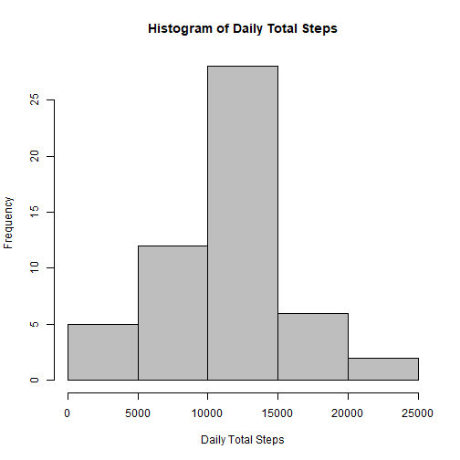
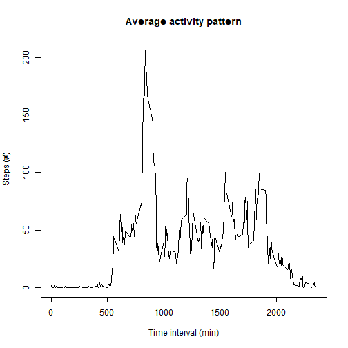
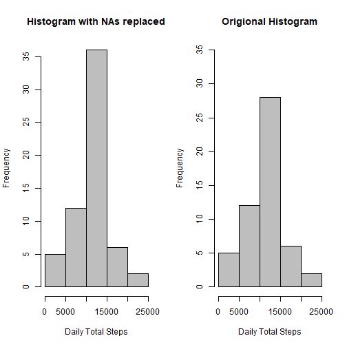
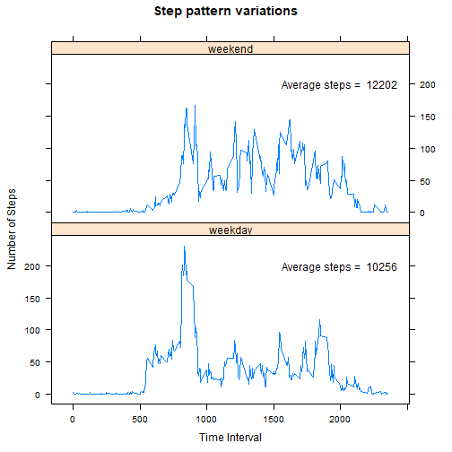

## Read the data into R

The data can be found here: [Activity data set](https://d396qusza40orc.cloudfront.net/repdata%2Fdata%2Factivity.zip)


```r
url <-"https://d396qusza40orc.cloudfront.net/repdata%2Fdata%2Factivity.zip"
download.file(url, "activity.zip")
unzip("activity.zip")
activity <- read.csv("activity.csv", header = TRUE)
```

## What is the man total number of steps taken per day


```r
dailyTotal <- aggregate(steps ~ date, activity, sum)
hist(dailyTotal$steps, xlab="Daily Total Steps", col="grey",
     main="Histogram of Daily Total Steps")
```



report the mean and median

```r
summary(dailyTotal$steps)[3:4]
```

```
##   Median     Mean 
## 10765.00 10766.19
```

## What is the daily activity pattern?


```r
pattern <- aggregate(steps ~ interval, activity, mean)
with(pattern, plot(steps ~ interval, type='l',
                   xlab = 'Time interval (min)',
                   ylab = 'Steps (#)',
                   main = 'Average activity pattern'))
```



Which 5 min interval has the most steps on average?

```r
with(pattern, interval[steps==max(steps)])
```

```
## [1] 835
```

## Inputing missing values

First determine how many values are missing.

```r
na_vals <- sum(is.na(activity$steps))
frac_na <- na_vals/length(activity$steps)
print(na_vals)
```

```
## [1] 2304
```

```r
print(frac_na)
```

```
## [1] 0.1311475
```

General strategy is to fill in missing values with the average value for that time interval (averaged across all days). Make a new dataset that has the missing values.

```r
activity2 <- activity
nas <- is.na(activity2$steps)
for(i in seq(length((activity2$steps)))) {
        if(is.na(activity2$steps[i])) {
                interval <- activity2$interval[i]
                activity2$steps[i] <- pattern$steps[pattern$interval==interval]
        }
}
```

Make a new histogram with the missing values replaced, and report mean and median values

```r
dailyTotal2 <- aggregate(steps ~ date, activity2, sum)
par(mfrow=c(1,2))
hist(dailyTotal2$steps, xlab="Daily Total Steps", col="grey",
     main="Histogram with NAs replaced")
hist(dailyTotal$steps, xlab="Daily Total Steps", col="grey", 
     main="Origional Histogram", ylim=c(0,35))
```



Report the mean and median with NAs replaced

```r
summary(dailyTotal2$steps)[3:4]
```

```
##   Median     Mean 
## 10766.19 10766.19
```

These median and mean values are similar to the ones without the missing values. However, the mean and median are even closer when the NA values are estimated. Estimating the missing values based on the average seemed to shift the data towards the mean (esentially everything that I estimaged ended up in the central bin between 10000 and 15000 steps. This seems to hapen since often entire days were missing values and they all recieved the same estimated # of steps). Caution should be used when replacing missing values, as the treatment may skew the results in a way that is not representative of the true population.

## Are there differences in the activity patterns between weekdays and weekends?

First convert to date class and determine which days are weekdns


```r
activity2$date <- as.Date(activity2$date, format="%Y-%m-%d")
activity2$day <- "weekday" #initialize new column with weekdays
activity2$day[weekdays(activity2$date)=="Saturday"] <- "weekend"
activity2$day[weekdays(activity2$date)=="Sunday"] <- "weekend"
```

Next split the data by catagories and plot

```r
library(lattice)
wpattern <- aggregate(steps ~ interval + day, activity2, mean)
averages <- round(with(wpattern, tapply(steps, day, sum)))
plttxt <- paste("Average steps = ", averages)
with(wpattern, xyplot(steps ~ interval | day, type="l", layout=c(1,2),
                      xlab = "Time Interval",
                      ylab = "Number of Steps",
                      main = "Step pattern variations",
                      panel=function(x,y,...){
                              panel.xyplot(x,y,...)
                              panel.text(2000, 200, labels=plttxt[panel.number()])
                      }))
```



There appears to be more activity on the weekends than the weekdays. It also appears that during the weekend there is less activity in the early time intervals (the morning). It would seem that this particular individual likes to sleep in on the weekends! 

